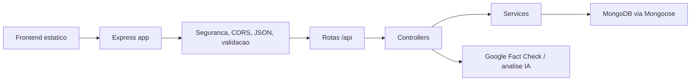

# Arquitetura

O VerificaOeste e uma aplicacao Node.js/Express com frontend estatico servido pela propria API. A organizacao principal fica em `src/`:

- `app.js`: cria o Express app, aplica middlewares globais, arquivos estaticos, Swagger e rotas.
- `routes/`: define contratos HTTP, autenticacao por rota, validacoes e rate limits locais.
- `controllers/`: orquestra request/response e delega regras de persistencia.
- `services/`: concentra operacoes reutilizaveis, como logs e historico de pesquisas.
- `models/`: schemas Mongoose para MongoDB.
- `public/`: HTML, CSS e JavaScript do frontend.

## Fluxo de verificacao

1. O usuario envia texto ou link pelo formulario em `public/index.html`.
2. `public/js/main.js` valida a entrada no cliente e chama `POST /api/verificar`.
3. `verificacao.routes.js` valida modo, tamanho e URL.
4. `verificacao.controller.js` extrai informacoes, aplica heuristicas de confiabilidade e consulta servicos externos quando configurados.
5. Se o usuario estiver autenticado, o frontend salva o resultado em `POST /api/search`.

## Autenticacao

O login emite JWT assinado com `JWT_SECRET`. Rotas protegidas usam `authJwt` e esperam `Authorization: Bearer <token>`. O frontend guarda o token em `localStorage`, atualiza a interface conforme `/api/auth/me` e remove o token quando a API retorna `401` ou `403`.

## Seguranca da borda

A aplicacao aplica:

- headers de seguranca basicos em `securityHeaders`;
- bloqueio de chaves `$` e `.` em payloads de cliente via `mongoSanitize`;
- rate limiting em cadastro, login, verificacao e salvamento de historico;
- CORS configuravel por `CORS_ORIGIN`;
- validacoes de entrada com `express-validator`.

Para producao com multiplas instancias, troque o rate limiter em memoria por Redis ou outro armazenamento compartilhado.

## Dados

O MongoDB armazena usuarios, logs, verificacoes documentais e pesquisas salvas. O modelo `Search` possui indices por usuario, data, modo e veredito para sustentar o historico paginado.
